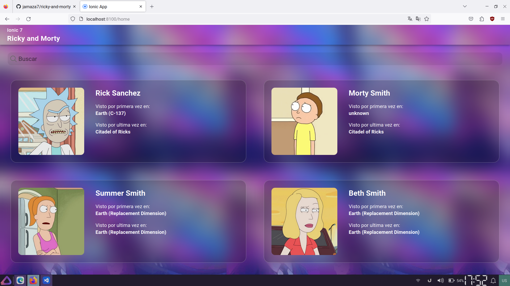

# Project Ionic-Angular

Consumir API Rick y Morty con Ionic-Angular

## Tabla de Contenidos

- [Instalación](#instalación)
- [Configuracion](#configuracion)
- [Ejecutar Proyecto](#ejecutar-proyecto)
- [Capturas](#capturas)
- [Licencia](#licencia)

## Installation

> **Nota:** Para ejecutar este proyecto debera tener instalado nodejs en la version **LTS** o posteriores

Clone the repository

```bash
  git clone https://github.com/jamaza7/ricky-and-morty.git
  cd ricky-and-morty
```

Instalar dependencias

```javascript
  npm i -g @ionic/cli
  npm install
```

### Ejecutar Proyecto

Para ejecutar el proyecto debera ejecutar el siguiente comando

```bash
  ionic serve
```

## Capturas




## Licencia

[MIT](https://choosealicense.com/licenses/mit/)
