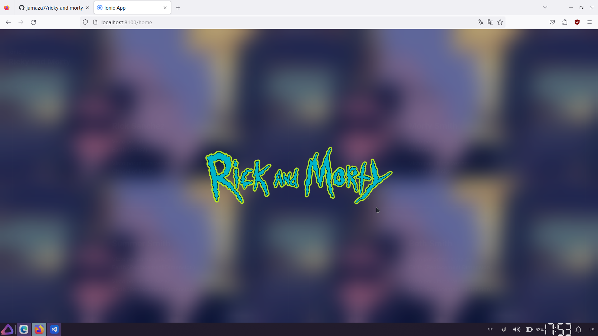

# Proyecto Ionic-Angular

Consumir API Rick y Morty con Ionic-Angular

### Tecnologías Utilizadas

El proyecto utiliza las siguientes tecnologías y herramientas:

- Angular
- Ionic
- HTML y CSS
- Git y GitHub para el control de versiones y documentación del proyecto.

## Tabla de Contenidos

- [Instalación](#instalación)
- [Ejecutar Proyecto](#ejecutar-proyecto)
- [Capturas](#capturas)
- [Créditos](#créditos)
- [Licencia](#licencia)

## Instalación

> **Nota:** Para ejecutar este proyecto debera tener instalado nodejs en la version **LTS** o posteriores

Clone the repository

```bash
  git clone https://github.com/jamaza7/ricky-and-morty.git
  cd ricky-and-morty
```

Instalar dependencias

```javascript
  npm i -g @ionic/cli
  npm install
```

### Ejecutar Proyecto

Para ejecutar el proyecto debera ejecutar el siguiente comando

```bash
  ionic serve
```

## Capturas




## Créditos

Agradecimientos al **Mgs. Patricio Vaca Esbocar** por
su orientación y apoyo valioso durante este perido academico 💯.

## Licencia

[MIT](https://choosealicense.com/licenses/mit/)
